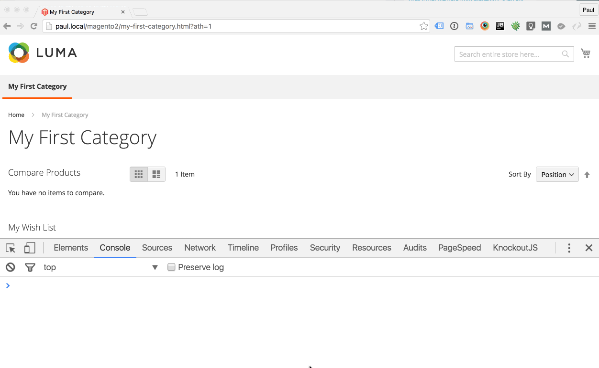
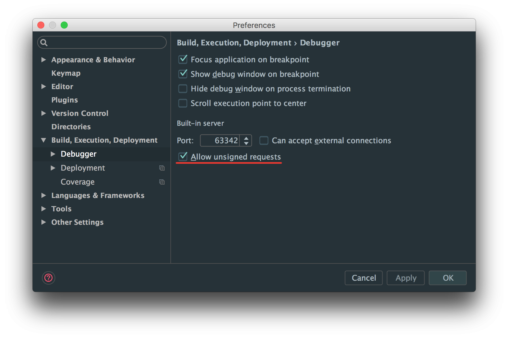
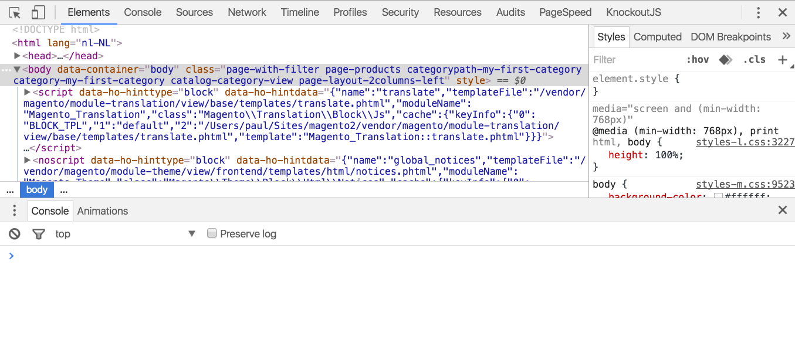

# H&O Magento 2 Advanced Template Hints module


Ho_Templatehints extends the default Magento template hints.

- Easily accessible with with muscle memory `?ath=1`.
- Shows hints for **Templates**, **AbstractBlocks** (Blocks), **Containers** and **UI Components**.
- No layout interference: Using css outline instead of borders of other HTML elements, so it doesn't f'up the layout.



## Installation

```
composer require honl/magento2-templatehints
php bin/magento module:enable Ho_Templatehints
php bin/magento setup:upgrade
```

### Development installation (git enabled)

```
composer require honl/magento2-templatehints "dev-master"
php bin/magento module:enable Ho_Templatehints
php bin/magento setup:upgrade
```

### Configure PHPStorm, allow remote calls



## Usage
1. Set your Magento 2 installation to developer mode (when in production mode make sure to add your IP-address in Developer Client Restrictions).
2. Add `?ath=1` to your URL to activate.
3. Open up your console in you Chrome/Firefox/Safari/~IE~ devtools.
4. hold <kbd>⇧</kbd> (shift)
5. Hover over the element you wish to inspect
6. Voila! Hints everywhere!

### Hints for hidden elements
You can't show hints for a hidden element, for that purpose there is `hint($0)`:

```JS
//Select an element in the Elements panel in your devtools, it is now available with $0
hint($0)
```




## Inner Workings
The module adds an additional html-attribute to the outer most element of a layout element.

## Credits
Inspiration from [Aoe_TemplateHints](https://github.com/AOEpeople/Aoe_TemplateHints) and a lot of love from H&O.

## Developer
This module was developed by the H&O team. Check out more about this module on the H&O website:
<a href="https://www.h-o.nl/blog/h-o-magento-2-advanced-template-hints-module">H&O Magento 2 Advanced Template hints module</a>

